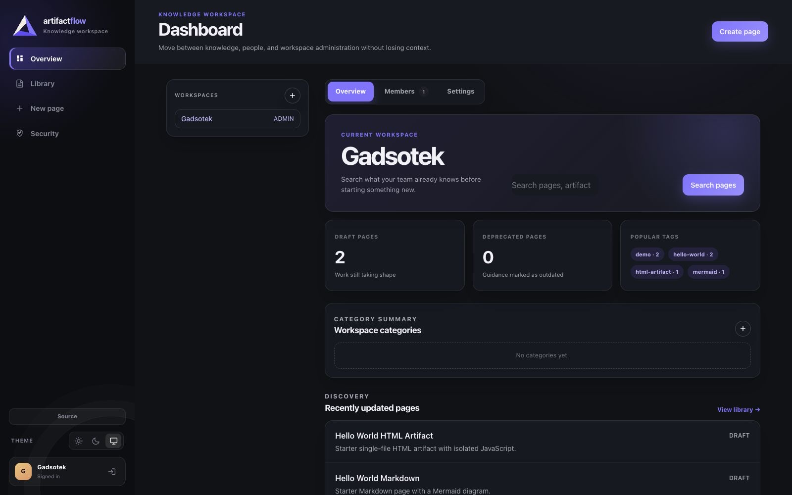
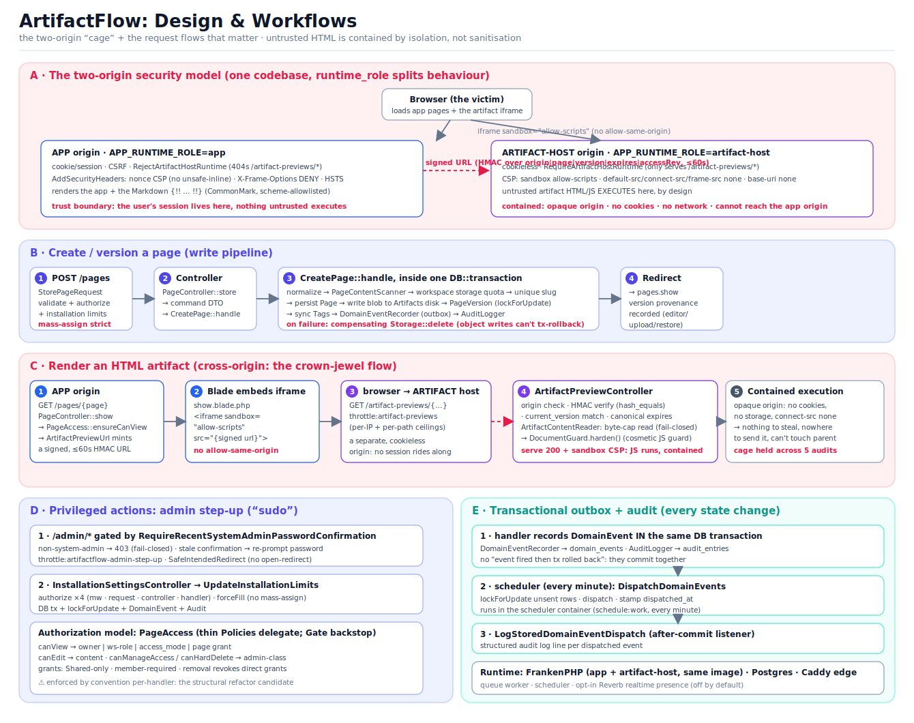

<div align="center">

# ArtifactFlow

**A self-hosted vault for safely storing, versioning, searching, and previewing untrusted AI‑generated HTML artifacts and Markdown: generated code runs sealed in a two‑origin sandbox, never on your app.**

[](LICENSE)
[](COMMERCIAL.md)
[](composer.json)
[](composer.json)
[](#status)

</div>

---

> [!WARNING]
> **Alpha — self‑hosted, evolving, not independently audited.** ArtifactFlow is a 0.x internal‑team tool, not a hardened multi‑tenant SaaS. Its security rests on a **two‑origin split that is mandatory, not optional**: a real deployment needs **two separate HTTPS origins** (the app and the artifact host), and the production boot gate **refuses to start** if that boundary — or any other part of its security contract — is incomplete. Expect breaking changes between alpha revisions; pin a revision for anything you depend on. Read the [threat model](THREAT-MODEL.md) (including its documented residuals) and the [operations guide](docs/OPERATIONS.md) before inviting users.

AI tools now generate dashboards, diagrams, runbooks, and one‑file HTML apps by the dozen. But those artifacts are **untrusted code**: you can't just open them on a page that carries your session cookie. ArtifactFlow is the place to keep them: an internal knowledge base where AI‑generated Markdown and single‑file HTML stay searchable, versioned, and *runnable*, without ever letting untrusted HTML execute on your authenticated origin.



## The core idea: containment by isolation, not sanitization

Most tools try to *scrub* untrusted HTML safe. ArtifactFlow doesn't trust scrubbing; it **quarantines execution to a separate origin**:

- **App origin**: your authenticated, cookie‑bearing surface. Untrusted artifact bytes never execute on this origin at all — even the pre‑save draft preview renders on the isolated artifact origin, exactly like a saved artifact.
- **Artifact‑host origin**: cookieless, on a different origin. Saved artifacts are served through short‑lived **HMAC‑signed URLs**. Before a draft can be posted cross-origin, the authenticated app issues a short-lived **HMAC capability** bound to its purpose, artifact origin, workspace, nonce, exact UTF-8 byte length, and SHA-256. Both render inside a `sandbox` iframe under a strict CSP (`default-src 'none'; connect-src 'none'`).

The artifact's JavaScript really *runs*, but in an opaque origin with no cookies, no ordinary subresource/connection access, and no reach back to your app. Nested browsing contexts are prohibited so hostile code cannot obtain a fresh child realm around the preview guard; the threat model documents the remaining browser-dependent and self-navigation residuals. Same codebase, one config flag flips the runtime role. The two runtimes serve deliberately different HTTP surfaces: the app can't serve artifact HTML, and the artifact host can't expose login, dashboard, or management routes. **Isolation is the boundary; scanning is only advisory on top.**



> Full architecture one‑pager: [`docs/architecture/README.md`](docs/architecture/README.md) · [architecture map — layers & layout](docs/architecture/overview.svg) · [workflows & the two‑origin model](docs/architecture/workflows.svg)

## Features

**🔒 Safe artifact rendering**
- Single‑file HTML artifacts execute only from the isolated, cookieless artifact origin behind sandboxed iframes; saved artifacts are reached through renewable signed short‑lived URLs, and pre‑save drafts through authenticated, content-bound short-lived capabilities. There is no expiry timer or parent-window reload: when a prototype self‑reload encounters an expired saved URL, the authenticated parent renews and restores only the iframe.
- Paste‑or‑upload preview in an opaque, no‑network sandbox *before* saving.
- Artifacts must be a **single self‑contained HTML file**: the sandbox blocks external scripts, styles, and network calls, so CDN‑linked dependencies (React, Tailwind, Chart.js…) will not load. Ask your AI to inline everything into one file. This is a deliberate boundary, not a limitation to work around — [it keeps the artifact offline, immutable, and sealed](THREAT-MODEL.md).
- Best‑effort secret‑blocking on save (credentials, private keys, JWTs, provider tokens) without persisting matched values; suspicious JS patterns are recorded as advisory findings. Scanning is advisory and bypassable by light obfuscation — a clean scan is not proof no secret was stored; isolation is the boundary.

**📚 Knowledge base**
- Markdown/wiki pages with a rich editor over portable Markdown source, inline Mermaid diagrams (strict, no external calls), and authorization‑aware `[[Page Name]]` wiki links. *(Markdown pages are a complementary surface, not the headline — that's safely running untrusted AI‑generated HTML/JS. The rich editor is a convenience over the **authoritative portable Markdown source**; switch to source view for byte‑exact control.)*
- Immutable, retention‑capped versioning (oldest pruned past a configurable limit) with historical previews, source diffs against the current version, restore, archive/unarchive, and Admin‑only hard delete. Historical HTML stays on the isolated artifact origin under the same opaque sandbox as the current preview.
- Weighted PostgreSQL full‑text search across metadata, tags, and extracted content, including text inside artifact source.
- Installation-wide tags stay consistent across workspaces; categories remain workspace-local, can be created while saving a page, and are qualified by workspace in cross-workspace filters. Moving a page reuses or creates its category in the target workspace, and the Library can create and open a new shared workspace directly.
- Personal + shared workspaces, Reader/Editor/Admin roles, and per‑page permission overrides that never leak restricted titles or UIDs. System Admin is an installation/account role, not a content superuser: page and workspace access still requires normal membership or an explicit page grant.
- An installation-wide coworker directory makes registered human users (including System Admins) discoverable by name, email, and UID to other authenticated humans. Those fields identify people but confer no authority: every page grant and workspace membership change is independently authorized server-side, and automation service accounts are excluded from human pickers. Explicit page Reader and Editor grants can be given without workspace membership; page Admin grants remain limited to members of the page workspace.

**🤖 AI‑first (MCP)**
- An [MCP](https://modelcontextprotocol.io) server (app‑origin only) lets approved AI clients `list_workspaces` / `list_taxonomy` / `search` / `read` / `create` / `create_category` / `create_tag` / `update` / `revert`, through the *same* handlers, policies, scanners, optimistic‑concurrency checks, and audit trail as humans. Page creation accepts category and tag names inline; standalone taxonomy writes require live Editor access in an in-scope workspace. Taxonomy discovery returns only searchable tags and workspace-qualified categories the token can reach, with all user-authored labels and slugs in explicit untrusted-data envelopes. Page search/read results include visibility-filtered parent, ancestor path, depth, and direct-child count metadata; inaccessible relatives remain undisclosed.
- MCP tokens can be read-only or read-write, scoped to selected workspaces, hard-capped to Editor authority (admin power stripped at code level), and receive content as explicit *untrusted-data envelopes*, never a shortcut around permissions.

**🛡️ Account & operational security**
- TOTP two‑factor auth with single‑use recovery codes and revocable trusted devices; required for admins by default, enforceable for all users. A fresh password login opens a visible three-minute first-enrollment window; expiry returns to password confirmation and invalidates the pending QR/secret so restarting produces a fresh one. Recovery-code sign-in is an explicit alternate mode.
- Optimistic concurrency (409 on stale writes) so concurrent edits never silently clobber.
- Step‑up password confirmation on sensitive actions, plus a fresh TOTP for MCP token creation; server‑side authorization everywhere; durable domain events + audit trail that never log secrets or raw content.
- Self‑hosted from day one: a production image with separate runtime roles, per‑install storage/limit controls, backup & restore tooling, and production boot that **fails closed** on misconfiguration.

## Local quickstart

Targets **PHP 8.5, Laravel 13, PostgreSQL, Caddy, FrankenPHP**. Local dev runs the app and artifact host as separate Compose services, so the origin boundary is real from the first run.

> This quickstart is for local evaluation and development. The bundled `docker-compose.yml` uses local credentials and non-TLS services; it is not a production deployment template.

**Prerequisites:** Docker with Compose v2 and GNU `make`. (PHP, Composer, and PostgreSQL all live inside the containers.) Contributors running the full quality gates additionally need `python3`, `semgrep`, and Node.js + npm — see [CONTRIBUTING.md](CONTRIBUTING.md).

**Step 1 — bring the stack up.** This one is on you: the install wizard runs *inside* the app container and needs the database reachable, so it cannot start Docker for you. Running it against a stopped stack fails with a `could not translate host name "db"` error.

```sh
make up            # boots the stack; scaffolds .env and a local signing key
# or: make up-local — same, plus edge proxy, Adminer, and Mailpit
```

Until Step 2 completes, application pages intentionally return a safe `503 Setup required` response instead of starting a database session against an uninitialized schema. MCP also fails before token lookup with a retryable JSON-RPC 503. The session-free `/up` healthcheck remains available while installation runs.

**Step 2 — run the guided installer** from inside the container:

```sh
make shell
php artisan artifactflow:install
```

The wizard asks which environment you're setting up; choose **local** for this stack. It generates any missing application and artifact signing keys, runs migrations, prompts for your first System Admin, and can add starter demo content (a Mermaid Markdown page plus an interactive HTML artifact). Then sign in at `http://localhost:18080/login`.

For an existing installation whose keys and administrator are already provisioned, `make migrate` is the complete schema-upgrade step. A manually provisioned fresh database also needs a System Admin; use the password-safe `artifactflow:bootstrap-admin` procedure in the [operations guide](docs/OPERATIONS.md#first-user-setup). The setup response clears on the first request after every migration file is recorded.

For an unattended local setup, pass `--env`, `--name`, `--email`, and `--seed-demo` instead of answering prompts, and supply the first admin password through a mounted secret **file** — point `ARTIFACTFLOW_ADMIN_PASSWORD_FILE` at it (a single trailing newline is stripped). Unlike an inline `VAR=… command` assignment, a file leaks the secret to neither shell history nor the process argv:

```sh
# ARTIFACTFLOW_ADMIN_PASSWORD_FILE=/run/secrets/af_admin_password in the environment
php artisan artifactflow:install \
  --env=local --name='Local admin' --email='admin@example.test' --seed-demo
```

The installer consumes the password and then clears it from its live config. The plain `ARTIFACTFLOW_ADMIN_PASSWORD` variable is still honored (export it from a secret manager rather than assigning it inline, which shell history records), and the legacy `--password` argument works but is visible in `ps`. Re-run the preflight checks anytime:

```sh
make run-app-cmd APP_CMD='php artisan artifactflow:doctor'
```

## Production self-hosting

ArtifactFlow supports production self-hosting. The supported production unit is the image built by `make build-prod` (and, after tagged releases, the corresponding published image), run with `APP_ENV=production`. The same image runs the separate `app`, `artifact-host`, `worker`, and `scheduler` roles: `APP_RUNTIME_ROLE` selects the role, and the `worker`/`scheduler` roles additionally override the container command to their start script (see the [operations guide](docs/OPERATIONS.md)).

The repository deliberately does **not** present its local Compose file as a one-click production stack. A real deployment must provide environment-specific orchestration, two HTTPS hostnames, PostgreSQL with verified TLS, persistent private storage, a secret manager, a rate-limit cache shared by every app replica, and a correctly scoped reverse proxy. That wiring differs across Docker Compose, Swarm, Kubernetes, and hosting platforms; the production boot gate refuses to start when its security contract is incomplete.

Production configuration — including `APP_KEY`, a dedicated `ARTIFACT_URL_SIGNING_KEY`, and a deliverable `MAIL_MAILER` — is supplied as environment variables from your secret manager, not by editing a `.env` inside the immutable image, and must be in place **before first boot**. Once the required variables are set, run the installer as a one-off container (the app container will not stay up until the gate passes). On the immutable image the installer does not generate keys or write `.env`; its production job is to run migrations and create the first System Admin, then hand off to the doctor:

```sh
# every boot-gate env var set, and ARTIFACTFLOW_ADMIN_PASSWORD_FILE=/run/secrets/af_admin_password:
docker run --rm --env-file <your-production-env> <your-image> \
  php artisan artifactflow:install --env=production --name='Ops' --email='ops@example.test'
docker run --rm --env-file <your-production-env> <your-image> \
  php artisan artifactflow:doctor
```

The full topology, runtime-role, TLS, proxy, database, storage, mail, and backup requirements live in the [operations guide](docs/OPERATIONS.md). Complete the [alpha release checklist](RELEASE-CHECKLIST.md) before inviting users.

## Security

Isolation is the execution boundary; everything else is defense in depth. Highlights:

- Untrusted inputs: HTML, Markdown, Mermaid, filenames, metadata, and search queries.
- Artifacts render only from the isolated origin behind sandboxed iframes, strict CSP, and no app cookies; saved artifacts require signed short‑lived URLs, while draft previews require an authenticated Editor to obtain a short‑lived capability bound to the exact content before the cookieless artifact endpoint will render it.
- Production boot fails closed on overlapping app/artifact origins, a missing/reused signing key, mismatched frame‑ancestors, public artifact storage, an absent admin‑bootstrap path, or a misconfigured realtime secret.
- TOTP secrets are `APP_KEY`‑encrypted at rest; recovery codes are one‑way hashes; trusted‑device cookies carry only opaque tokens.

Read the full [**threat model**](THREAT-MODEL.md) and [operations guide](docs/OPERATIONS.md). Found a vulnerability? See [SECURITY.md](SECURITY.md), and note the sandbox is *meant* to execute script, so report **escapes**, not "the artifact ran JavaScript."

## Documentation

- [Architecture](docs/ARCHITECTURE.md): layers, application modules, the runtime‑role split.
- [Roadmap](ROADMAP.md): the alpha scope boundary and post-alpha product directions.
- [Operations](docs/OPERATIONS.md): deploy, backup/restore, MCP tokens, 2FA break‑glass.
- [Threat model](THREAT-MODEL.md) · [Contributing](CONTRIBUTING.md) · [Code of Conduct](CODE_OF_CONDUCT.md) · [Changelog](CHANGELOG.md)

## Status

**Alpha.** The security model and feature set are implemented and have been through repeated internal, AI-assisted adversarial review (not an independent third-party audit), PHPStan‑max, 100% type coverage, and a broad test suite, but it's young and still evolving. Expect changes; pin a revision for anything you depend on.

## Development

Tests‑first for behavioral changes. The gates that must stay green:

```sh
make ecs        # code style        make e2e          # Playwright
make stan       # PHPStan (max)     make build-prod   # production image
make test       # Pest suite        make scan-image   # Trivy
make type-coverage   # 100%         make audit        # composer + npm
make coverage        # PCOV line coverage (94% floor)
make run-app-cmd APP_CMD='composer rector'            # conservative dry run
semgrep --test --config .semgrep/artifactflow.yml .semgrep/artifactflow.php --metrics=off
```

Note the distinction: **type** coverage is enforced at **100%**; **line** coverage is gated at a **94% floor** (`COVERAGE_MIN`), via CI's `make coverage`, not `phpunit.xml`.

`make quality-full` is the authoritative aggregate for the Make-backed gates (including `make publish-guard`, `make ai-hooks-test`, `make semgrep`, and the asset/production/image gates). Run the Rector and Semgrep-fixture commands above separately; CI also enforces them. `.semgrep/artifactflow.php` is the custom-rule positive/negative fixture corpus, not application code; update it whenever `.semgrep/artifactflow.yml` changes. Run `make compose-config` too when Docker or env files change. One gate included by `make quality-full`, `make verify-reverb-origin`, drives a running stack to prove the WebSocket origin check rejects foreign origins; CI does not reproduce that live probe, so run it locally before a release.

See [AGENTS.md](AGENTS.md) for the full working agreements. AI‑assistant guardrails live in `CLAUDE.md`, `.claude/`, `.codex/`, and `scripts/ai-hooks/`. Yes, this project is built AI‑assisted: AI helped throughout, held to the same quality bar as the rest of the project. The rigor behind it (the audits, the gates, the threat model) is the point.

## License

Copyright (C) 2026 Gadsotek &lt;gadsotek@gmail.com&gt;

**AGPL‑3.0‑or‑later**: see [LICENSE](LICENSE). If you modify ArtifactFlow and run it for users over a network, the AGPL requires you to offer them the corresponding source; set `APP_SOURCE_URL` to your public source URL.

A **commercial license** for proprietary use, closed forks, or managed‑service deployments that can't comply with the AGPL is available: see [COMMERCIAL.md](COMMERCIAL.md) or contact Gadsotek &lt;gadsotek@gmail.com&gt;.

Contributions are accepted under the AGPL with a DCO sign‑off and a one‑time [CLA](CLA.md) signature that keeps the dual‑licensing model viable; contributors retain their copyright. Details in [CONTRIBUTING.md](CONTRIBUTING.md).
