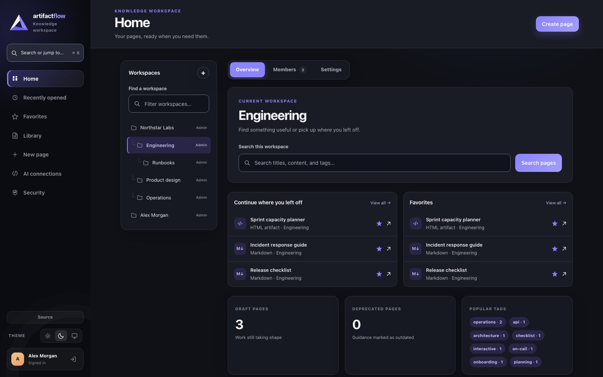
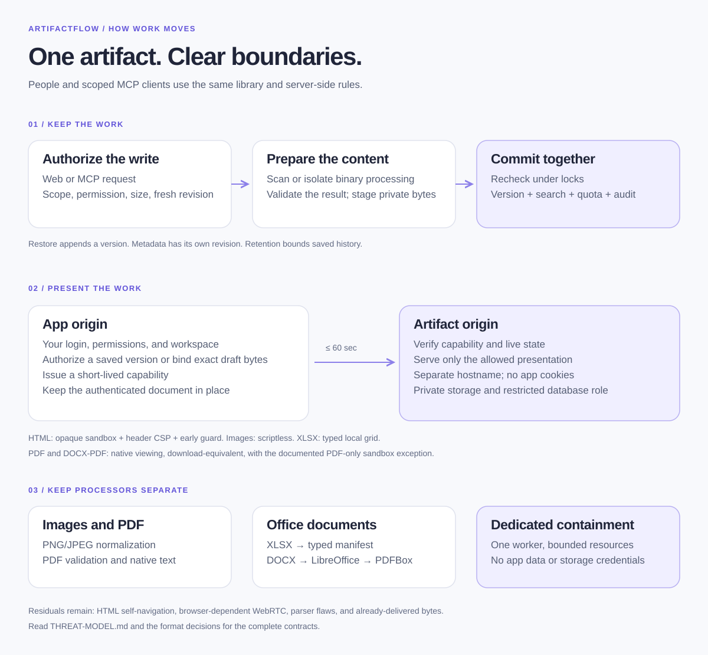

<div align="center">

# ArtifactFlow

**A self-hosted, versioned artifact vault for tools and documents created with AI. Keep the authoritative source or original, every retained version, searchable content, ownership, permissions, safe previews, and audit history.**

[artifactflow.app](https://artifactflow.app) · [Artifact workflow](https://artifactflow.app/workflow/) · [Roadmap](https://artifactflow.app/roadmap/) · [Source](https://github.com/Gadsotek/artifactflow)

[](LICENSE)
[](COMMERCIAL.md)
[](composer.json)
[](composer.json)
[](#status)

</div>

---

> [!WARNING]
> **Alpha — self‑hosted, evolving, not independently audited.** ArtifactFlow is a 0.x internal‑team tool, not a hardened multi‑tenant SaaS. Its security rests on a **two‑origin split that is mandatory, not optional**: a real deployment needs **two separate HTTPS origins** (the app and the artifact host), and the production boot gate **refuses to start** if that boundary — or any other part of its security contract — is incomplete. Expect breaking changes between alpha revisions; pin a revision for anything you depend on. Read the [threat model](THREAT-MODEL.md) (including its documented residuals) and the [operations guide](docs/OPERATIONS.md) before inviting users.

AI tools now produce useful dashboards, diagrams, runbooks, reports, and one-file HTML apps by the dozen. A chat is temporary, a new software project is often too heavy, and static hosting does not provide a searchable system of record with ownership, permissions, versions, and audit history.

ArtifactFlow is **the missing artifact layer between AI chat and production**. It turns a deliberate AI output into a managed team asset without requiring every calculator, one-pager, or document to become its own repository and deployment.

> **Preserves the output, not the conversation.** ArtifactFlow is not agent memory, a vector database, a chat archive, an AI generator, or a static site generator. Agents and people preserve artifacts in the vault; teams search, preview, run, update, and govern them.

The current public alpha supports Markdown pages, Mermaid diagrams, self-contained HTML artifacts, normalized PNG/JPEG screenshots or images, and default-off searchable native-text PDF artifacts. PDF requires a dedicated isolated processor and explicit production opt-in; Word documents remain roadmap work. See the [roadmap](ROADMAP.md).



## The core idea: containment by isolation, not sanitization

Most tools try to *scrub* untrusted HTML safe. ArtifactFlow doesn't trust scrubbing; it **quarantines execution to a separate origin**:

- **App origin**: your authenticated, cookie‑bearing surface. Untrusted artifact bytes never execute on this origin at all — even the pre‑save draft preview renders on the isolated artifact origin, exactly like a saved artifact.
- **Artifact‑host origin**: cookieless, on a different origin. Saved artifacts are served through short‑lived **HMAC‑signed URLs**. Before a draft can be posted cross-origin, the authenticated app issues a short-lived **HMAC capability** bound to its purpose, artifact origin, workspace, nonce, exact UTF-8 byte length, and SHA-256. Both render inside a `sandbox` iframe under a strict CSP (`default-src 'none'; connect-src 'none'`).

The artifact's JavaScript really *runs*, but in an opaque origin with no cookies, no ordinary subresource/connection access, and no reach back to your app. Nested browsing contexts are prohibited so hostile code cannot obtain a fresh child realm around the preview guard; the threat model documents the remaining browser-dependent and self-navigation residuals. Same codebase, one config flag flips the runtime role. The two runtimes serve deliberately different HTTP surfaces: the app can't serve artifact HTML, and the artifact host can't expose login, dashboard, or management routes. **Isolation is the boundary; scanning is only advisory on top.**



> Full architecture one‑pager: [`docs/architecture/README.md`](docs/architecture/README.md) · [architecture map — layers & layout](docs/architecture/overview.svg) · [workflows & the two‑origin model](docs/architecture/workflows.svg)

## Features

**🔒 Safe artifact rendering**
- Single‑file HTML artifacts execute only from the isolated, cookieless artifact origin behind sandboxed iframes; saved artifacts are reached through renewable signed short‑lived URLs, and pre‑save drafts through authenticated, content-bound short-lived capabilities. There is no expiry timer or parent-window reload: when a prototype self‑reload encounters an expired saved URL, the authenticated parent renews and restores only the iframe.
- PNG/JPEG uploads are sent over an authenticated Unix socket to a dedicated, resource-capped decoder container with no Docker network, application source, database, or artifact storage. It decodes under byte, dimension, and pixel limits and returns only a signed, re-encoded derivative, stripping EXIF/GPS, comments, profiles, and appended payloads. The original upload is discarded. The normalized pixels render from the artifact origin in a scriptless sandboxed iframe with a fixed application-owned viewer.
- Opt-in PDFs are synchronously validated and native text is extracted by a dedicated single-worker processor. Local deployments use a networkless Unix socket; private-network platforms use the separately published processor image, whose app and native children inherit a fail-closed outbound syscall deny. Authorized originals render only on the cookieless artifact origin in the browser's native viewer and are explicitly download-equivalent.
- Paste‑or‑upload preview in an opaque, network-restricted sandbox *before* saving.
- Artifacts must be a **single self‑contained HTML file**: CSP and defense-in-depth guards block ordinary external subresources and connection APIs, so CDN‑linked dependencies (React, Tailwind, Chart.js…) will not load. Script-initiated top-level navigation cannot be fully prevented, and WebRTC blocking is browser-dependent; the opaque origin still keeps app cookies and tenant data out of reach. Ask your AI to inline everything into one file. This is a deliberate boundary, not a limitation to work around; [the threat model documents the residuals and browser boundary](THREAT-MODEL.md).
- Best‑effort secret‑blocking on save (credentials, private keys, JWTs, provider tokens) without persisting matched values; suspicious JS patterns are recorded as advisory findings. Scanning is advisory and bypassable by light obfuscation — a clean scan is not proof no secret was stored; isolation is the boundary.

**📦 Versioned artifact vault**
- Markdown/wiki pages with a rich editor over portable Markdown source, inline Mermaid diagrams (strict, no external calls), and authorization‑aware `[[Page Name]]` wiki links. Markdown, HTML, and normalized raster images are the current artifact types within the vault; none defines the product category. The rich editor is a convenience over the **authoritative portable Markdown source**; switch to source view for byte‑exact control.
- Immutable, retention‑capped versioning (oldest pruned past a configurable limit) with optional short change summaries, historical previews, source diffs against the current version, restore, archive/unarchive, and Admin‑only hard delete. Historical HTML stays on the isolated artifact origin under the same opaque sandbox as the current preview.
- Version-level AI provenance keeps ArtifactFlow-observed ingest facts separate from optional producer claims. MCP clients retain every safe fact they know: an exact provider/model ID when available, or a partial provider/model-family claim without invented precision. Bounded identity extensions and external origin references remain self-reported; restores retain byte lineage, and provenance survives ordinary version-content pruning.
- Weighted PostgreSQL full‑text search across metadata, tags, extracted content, and human-readable producer labels, plus structured provider/model filters over page origin, current version, or any historical version. Image pixels are deliberately not OCRed; image artifacts are found through title, description, category, tags, owner, status, type, and declared provenance.
- Installation-wide tags stay consistent across workspaces; categories remain workspace-local, can be created while saving a page, and are qualified by workspace in cross-workspace filters. Moving a page reuses or creates its category in the target workspace, and the Library can create and open a new shared workspace directly.
- Personal + shared workspaces, Reader/Editor/Admin roles, and per‑page permission overrides that never leak restricted titles or UIDs. System Admin is an installation/account role, not a content superuser: page and workspace access still requires normal membership or an explicit page grant.
- Shared workspaces can form a three-level tree. Parent membership inheritance is on by default, can be disabled when a child is created, and an Admin can remove one inherited user locally without changing the parent membership; independent direct roles at that child or below remain effective.
- An installation-wide coworker directory makes registered human users (including System Admins) discoverable by name, email, and UID to other authenticated humans. Those fields identify people but confer no authority: every page grant and workspace membership change is independently authorized server-side, and automation service accounts are excluded from human pickers. Explicit page Reader and Editor grants can be given without workspace membership; page Admin grants remain limited to members of the page workspace.

**🔗 Narrow external sharing (alpha)**
- Access managers can create either a reusable link with a required expiry or a one-time link that starts exactly one browser-window viewing session. Links remain revocable, follow the latest version, disclose no workspace/catalog/source/history surface, and preserve the normal Markdown, isolated-HTML, and scriptless-image presentation boundaries. The default-off PDF milestone reuses this capability with its isolated native viewer; PDF viewing is download-equivalent even though ArtifactFlow adds no separate anonymous download endpoint. The maximum expiring-link lifetime is configured by System Admins in whole days (1–30); one-time links remain usable until redeemed or revoked.
- Share secrets are returned once in the URL fragment and stored only as hashes. One-time redemption requires an explicit confirmation, survives reload in the winning window, and cannot be reused from an independently opened window that merely shares the same cookie jar. The window proof is not DRM and cannot stop an authorized recipient from deliberately copying already delivered content or cloning client-held state. The external viewer uses the app’s visual language, supports light/dark/system themes, and formats expiry instants in the recipient’s local time zone.

**🤖 First-class MCP interface**
- An [MCP](https://modelcontextprotocol.io) server using the official Laravel MCP transport (app‑origin only) lets approved AI clients `list_workspaces` / `list_taxonomy` / `search` / `read` / `create` / `create_image` / `create_pdf` / `create_category` / `create_tag` / `organize` / `update` / `replace_image` / `replace_pdf` / `update_description` / `revert` / `create_external_share`, through the *same* handlers, policies, scanners, parser isolation, optimistic-concurrency checks, and audit trail as humans. `create` and `create_image` accept a real `parent_page_uid`; `organize` can revision-safely change only title, parent, category, and tags. `mcp:organize` separately gates organization and taxonomy creation. Binary creation requires `mcp:create` plus `mcp:upload`, replacement requires `mcp:update` plus `mcp:upload`, and both accept only canonical bounded Base64 before the format-specific isolated processor. The server never fetches an upload URL. Image reads return normalized derivatives up to the configured `ARTIFACT_MAX_BYTES` (10 MiB by default, hard-capped at 64 MiB — the same read limit every page type shares, expanded by roughly a third once base64-framed) as a standard MCP image content block plus a machine-readable searchability hint; a retained derivative above that configured limit fails MCP read with `content_too_large` before its bytes are loaded or base64-expanded. Because pixels are not OCR-indexed, a missing description recommends `update_description`. Default-off PDF support returns only enveloped extracted text and safe facts—never raw PDF bytes or signed URLs. Taxonomy discovery remains usage-visible: it returns only global tags attached to searchable pages and workspace-qualified categories the token can reach, with user-authored labels and slugs in explicit untrusted-data envelopes. Page search/read results include visibility-filtered parent, ancestor path, depth, and direct-child count metadata; inaccessible relatives remain undisclosed.
- MCP content writes accept optional, self-reported producer provenance. AI claims may be exact or partial: ArtifactFlow stores the reported provider alongside its normalized search key, accepts a best-known model family/label without requiring `model_id`, and computes completeness instead of rejecting useful fields. Short forward-compatible identity extensions are bounded and scanned; prompts, reasoning, credentials, authorization data, URLs, and content/blob payloads are rejected. MCP-reported client name/version stays separate, is not attested identity, and is never used to guess the model. Every successful create/update/image write returns `stored_provenance`, and server instructions tell the caller to disclose what was actually retained. `read` exposes the current version's ingest, direct producer, page origin, and effective restored-content origin; `search` can answer queries such as “everything Anthropic Opus produced” without exposing inaccessible pages.
- MCP initialization and write-tool schemas instruct AI clients to generate HTML artifacts as single self-contained documents with inline dependencies and no CDN or network-dependent features. Every MCP `create`, `update`, and `revert` content-version write requires a concise `change_summary`; `read` returns the current summary in an explicit untrusted-data envelope.
- MCP tokens can be read-only or read-write, scoped to selected workspaces, hard-capped to Editor authority (admin power stripped at code level), and receive content as explicit *untrusted-data envelopes*, never a shortcut around permissions. Authenticated request and write-rate budgets are shared by every token belonging to the same principal, so minting extra tokens does not multiply throughput. External-share creation is separately opt-in through `mcp:share`: it is limited to an in-scope page the MCP principal owns and can still edit, and the workspace must allow Editors and page owners to share pages. Human and service-account principals follow the same rule. The bearer URL is returned exactly once; treat it as a secret and never place it in an artifact, metadata, prompt, or log.

**🛡️ Account & operational security**
- TOTP two‑factor auth with single‑use recovery codes and revocable trusted devices; required for admins by default, enforceable for all users. A fresh password login opens a visible three-minute first-enrollment window; expiry returns to password confirmation and invalidates the pending QR/secret so restarting produces a fresh one. Recovery-code sign-in is an explicit alternate mode.
- Login is protected by per-email/IP, per-IP, and account-global rate limits, while password recovery has its own email/IP limit. Internet-facing operators may additionally configure Cloudflare Turnstile on login and both password-recovery forms; it is absent by default, appears automatically when both keys are supplied, and remains defense in depth rather than a replacement for rate limiting.
- Optimistic concurrency (409 on stale writes) so concurrent edits never silently clobber.
- Step‑up password confirmation on account-security actions; entering Administration instead requires a live authenticator or single-use recovery code, and MCP token creation requires both the current password and a fresh TOTP. Server-side authorization applies everywhere, with durable domain events and an audit trail that never log secrets or raw content.
- Self‑hosted from day one: a production image with separate runtime roles, per‑install storage/limit controls, backup & restore tooling, and production boot that **fails closed** on misconfiguration.

## Local quickstart

Targets **PHP 8.5, Laravel 13, PostgreSQL, Caddy, FrankenPHP**. Local dev runs the app and artifact host as separate Compose services, so the origin boundary is real from the first run.

> This quickstart is for local evaluation and development. The bundled `docker-compose.yml` uses local credentials and non-TLS services; it is not a production deployment template.

**Prerequisites:** Docker with Compose v2 and GNU `make`. (PHP, Composer, and PostgreSQL all live inside the containers.) Contributors running the full quality gates additionally need `python3`, `semgrep`, and Node.js + npm — see [CONTRIBUTING.md](CONTRIBUTING.md).

**Step 1 — bring the stack up.** This one is on you: the install wizard runs *inside* the app container and needs the database reachable, so it cannot start Docker for you. Running it against a stopped stack fails with a `could not translate host name "db"` error.

```sh
make up            # boots the stack; scaffolds .env and distinct local boundary secrets
# or: make up-local — same, plus edge proxy, Adminer, and Mailpit
```

The core local stack includes Reverb and the isolated PDF processor. The guided
installer keeps PDF application behavior disabled by default and offers a local/test
opt-in that persists `PDF_PROCESSOR_ENABLED=true`. Both native processors use
socket-only transport with no Docker network or public port.

Until Step 2 completes, application pages intentionally return a safe `503 Setup required` response instead of starting a database session against an uninitialized schema. MCP also fails before token lookup with a retryable JSON-RPC 503. The session-free `/up` healthcheck remains available while installation runs.

**Step 2 — run the guided installer** from inside the container:

```sh
make shell
php artisan artifactflow:install
```

The wizard asks which environment you're setting up; choose **local** for this stack. It generates any missing application key, artifact signing key, and image-parser shared secret, offers the default-off experimental PDF feature and provisions its processor secret when selected, runs migrations, prompts for your first System Admin, and can add starter demo content (a Mermaid Markdown page plus an interactive HTML artifact). Pass `--reverb` to provision and enable realtime locally. If the installer generates service configuration or changes the PDF setting, exit the container and rerun `make up` so Compose recreates the affected services with the persisted values. Then sign in at `http://localhost:18080/login`.

For an existing installation whose keys and administrator are already provisioned, `make migrate` is the complete schema-upgrade step. A manually provisioned fresh database also needs a System Admin; use the password-safe `artifactflow:bootstrap-admin` procedure in the [operations guide](docs/OPERATIONS.md#first-user-setup). The setup response clears on the first request after every migration file is recorded.

For an unattended local setup, pass `--env`, `--name`, `--email`, `--seed-demo`, and `--no-interaction` instead of answering prompts. Add `--pdf` to opt in. Supply the first admin password through a mounted secret **file** — point `ARTIFACTFLOW_ADMIN_PASSWORD_FILE` at it (a single trailing newline is stripped). Unlike an inline `VAR=… command` assignment, a file leaks the secret to neither shell history nor the process argv:

```sh
# ARTIFACTFLOW_ADMIN_PASSWORD_FILE=/run/secrets/af_admin_password in the environment
php artisan artifactflow:install \
  --env=local --name='Local admin' --email='admin@example.test' \
  --pdf --seed-demo --no-interaction
```

The installer consumes the password and then clears it from its live config. The plain `ARTIFACTFLOW_ADMIN_PASSWORD` variable is still honored (export it from a secret manager rather than assigning it inline, which shell history records), and the legacy `--password` argument works but is visible in `ps`. Re-run the preflight checks anytime:

```sh
make run-app-cmd APP_CMD='php artisan artifactflow:doctor'
```

## Production self-hosting

ArtifactFlow supports production self-hosting. `make build-prod` builds the application image plus the separately isolated native-parser images so the complete runtime set can be scanned; tagged releases currently publish only the application image. Run the application image with `APP_ENV=production`. The same application image runs the separate `app`, `artifact-host`, `worker`, and `scheduler` roles: `APP_RUNTIME_ROLE` selects the role, and the `worker`/`scheduler` roles additionally override the container command to their start script (see the [operations guide](docs/OPERATIONS.md)).

The repository deliberately does **not** present its local Compose file as a one-click production stack. A real deployment must provide environment-specific orchestration, two HTTPS hostnames, PostgreSQL with verified TLS, persistent private storage, a secret manager, a rate-limit cache shared by every app replica, and a correctly scoped reverse proxy. That wiring differs across Docker Compose, Swarm, Kubernetes, and hosting platforms; the production boot gate refuses to start when its security contract is incomplete.

Production configuration — including `APP_KEY`, a dedicated `ARTIFACT_URL_SIGNING_KEY`, and a deliverable `MAIL_MAILER` — is supplied as environment variables from your secret manager, not by editing a `.env` inside the immutable image, and must be in place **before first boot**. Once the required variables are set, run the installer as a one-off container (the app container will not stay up until the gate passes). On the immutable image the installer does not generate keys or write `.env`; its production job is to run migrations and create the first System Admin, then hand off to the doctor:

```sh
# every boot-gate env var set, and ARTIFACTFLOW_ADMIN_PASSWORD_FILE=/run/secrets/af_admin_password:
docker run --rm --env-file <your-production-env> <your-image> \
  php artisan artifactflow:install --env=production --name='Ops' --email='ops@example.test'
docker run --rm --env-file <your-production-env> <your-image> \
  php artisan artifactflow:doctor
```

The full topology, runtime-role, TLS, proxy, database, storage, mail, and backup requirements live in the [operations guide](docs/OPERATIONS.md). Complete the [alpha release checklist](RELEASE-CHECKLIST.md) before inviting users.

## Security

Isolation is the execution boundary; everything else is defense in depth. Highlights:

- Untrusted inputs: HTML, Markdown, Mermaid, raster image bytes, filenames, metadata, and search queries.
- Artifacts render only from the isolated origin behind sandboxed iframes, strict CSP, and no app cookies; saved artifacts require signed short‑lived URLs, while draft previews require an authenticated Editor to obtain a short‑lived capability bound to the exact content before the cookieless artifact endpoint will render it.
- Production boot fails closed on overlapping app/artifact origins, a missing/reused signing key, mismatched frame‑ancestors, public artifact storage, an absent admin‑bootstrap path, or a misconfigured realtime secret.
- TOTP secrets are `APP_KEY`‑encrypted at rest; recovery codes are one‑way hashes; trusted‑device cookies carry only opaque tokens.

Read the full [**threat model**](THREAT-MODEL.md) and [operations guide](docs/OPERATIONS.md). Found a vulnerability? See [SECURITY.md](SECURITY.md), and note the sandbox is *meant* to execute script, so report **escapes**, not "the artifact ran JavaScript."

## Documentation

- [Artifact workflow](docs/ARTIFACT-LIFECYCLE.md): stable identity, immutable content versions, draft lifecycle state, metadata changes, and future document payloads.
- AI provenance: observed ingest facts, declared model claims, lineage, search, privacy, and retention are documented in the public architecture and artifact-lifecycle guides; supporting implementation records remain internal unless explicitly published.
- [Architecture](docs/ARCHITECTURE.md): layers, application modules, the runtime‑role split.
- [External sharing architecture](docs/architecture/external-sharing.md): capability exchange, one-time/window semantics, MCP creation limits, revocation, and presentation boundaries.
- Default-off searchable PDF support: the public [architecture and security decision](docs/architecture/pdf-artifacts.md) defines its reviewable boundary. Production enablement is an explicit operator choice and requires the dedicated isolated processor, its deployment containment proof, and the documented browser/release evidence.
- [Roadmap](ROADMAP.md): the alpha scope boundary and post-alpha product directions.
- [Operations](docs/OPERATIONS.md): deploy, backup/restore, MCP tokens, 2FA break‑glass.
- [Threat model](THREAT-MODEL.md) · [Contributing](CONTRIBUTING.md) · [Code of Conduct](CODE_OF_CONDUCT.md) · [Changelog](CHANGELOG.md)

## Status

**Alpha.** The security model and feature set are implemented and have been through repeated internal, AI-assisted adversarial review (not an independent third-party audit), PHPStan‑max, 100% type coverage, and a broad test suite, but it's young and still evolving. Expect changes; pin a revision for anything you depend on.

## Development

Tests‑first for behavioral changes. The gates that must stay green:

```sh
make ecs        # code style        make e2e          # Playwright
make stan       # PHPStan (max)     make build-prod   # production image
make test       # Pest suite        make scan-image   # Trivy
make type-coverage   # 100%         make audit        # composer + npm
make coverage        # PCOV line coverage (94% floor)
make run-app-cmd APP_CMD='composer rector'            # conservative dry run
semgrep --test --config .semgrep/artifactflow.yml .semgrep/artifactflow.php --metrics=off
```

Note the distinction: **type** coverage is enforced at **100%**; **line** coverage is gated at a **94% floor** (`COVERAGE_MIN`), via CI's `make coverage`, not `phpunit.xml`.

`make quality-full` is the authoritative aggregate for the Make-backed gates (including `make publish-guard`, `make ai-hooks-test`, `make semgrep`, and the asset/production/image gates). Run the Rector and Semgrep-fixture commands above separately; CI also enforces them. `.semgrep/artifactflow.php` is the custom-rule positive/negative fixture corpus, not application code; update it whenever `.semgrep/artifactflow.yml` changes. Run `make compose-config` too when Docker or env files change. One gate included by `make quality-full`, `make verify-reverb-origin`, drives a running stack to prove the WebSocket origin check rejects foreign origins; CI does not reproduce that live probe, so run it locally before a release.

See [AGENTS.md](AGENTS.md) for the full working agreements. AI‑assistant guardrails live in `CLAUDE.md`, `.claude/`, `.codex/`, and `scripts/ai-hooks/`. Yes, this project is built AI‑assisted: AI helped throughout, held to the same quality bar as the rest of the project. The rigor behind it (the audits, the gates, the threat model) is the point.

## License

Copyright (C) 2026 Gadsotek &lt;gadsotek@gmail.com&gt;

**AGPL‑3.0‑or‑later**: see [LICENSE](LICENSE). If you modify ArtifactFlow and run it for users over a network, the AGPL requires you to offer them the corresponding source; set `APP_SOURCE_URL` to your public source URL.

A **commercial license** for proprietary use, closed forks, or managed‑service deployments that can't comply with the AGPL is available: see [COMMERCIAL.md](COMMERCIAL.md) or contact Gadsotek &lt;gadsotek@gmail.com&gt;.

Contributions are accepted under the AGPL with a DCO sign‑off and a one‑time [CLA](CLA.md) signature that keeps the dual‑licensing model viable; contributors retain their copyright. Details in [CONTRIBUTING.md](CONTRIBUTING.md).
