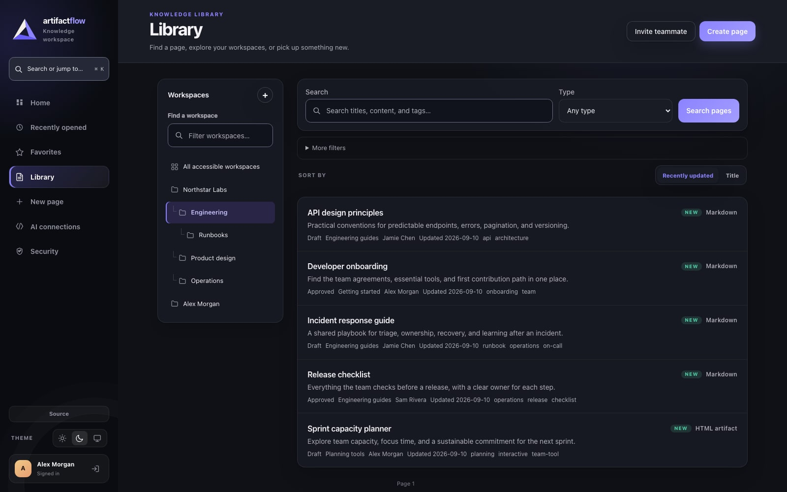
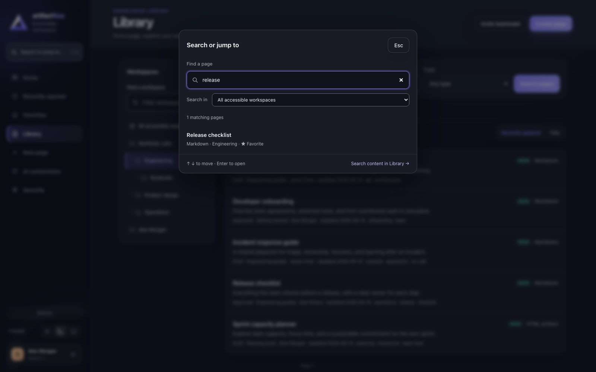
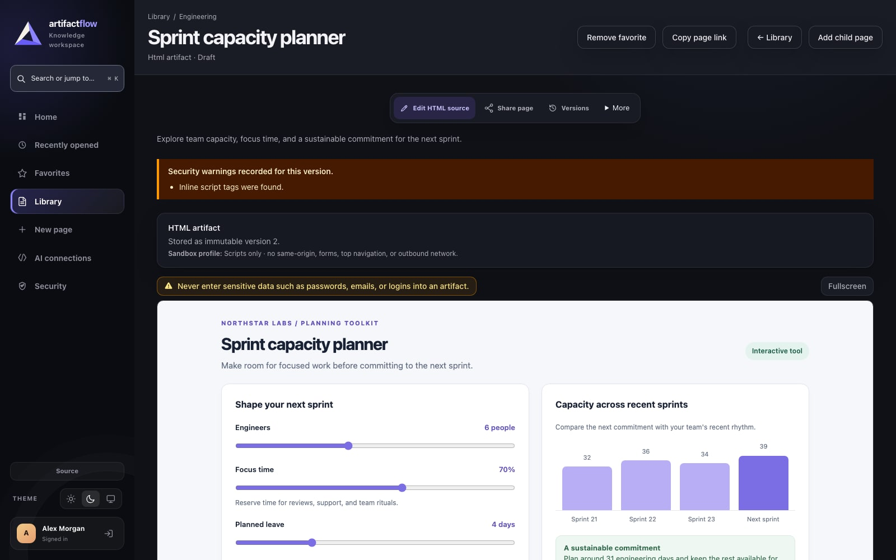
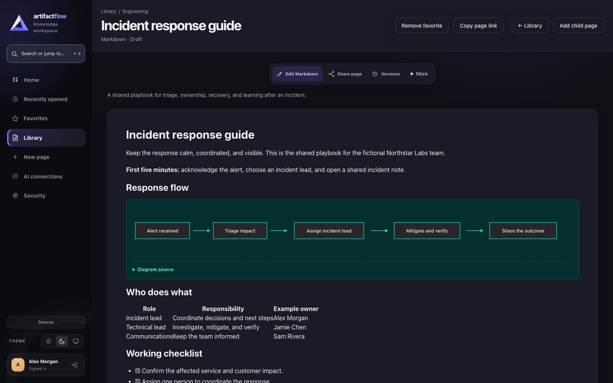

<div align="center">

# ArtifactFlow

**Your AI work, in one place.**

Open-source, self-hosted, model-agnostic workspace for AI-generated artifacts.

[Website](https://artifactflow.app) · [How it works](https://artifactflow.app/workflow/) · [MCP](https://artifactflow.app/mcp/) · [Self-hosting](https://artifactflow.app/self-hosting/)

[](LICENSE)
[](COMMERCIAL.md)
[](#status)

</div>

Useful AI work gets scattered across chats, downloads, repositories, and people.
ArtifactFlow gives your team and authorized AI clients one shared place to keep,
find, share, and continue working on the outputs worth retaining.


Screenshots show the fictional Northstar Labs team and sample content.

## What you can do

- **Keep and organize:** save artifacts in personal or shared workspaces with owners, categories, tags, and page hierarchy.
- **Find and share:** search content and metadata, apply workspace roles and page permissions, or create narrow revocable expiring or one-time page links.
- **Get back to work:** use private favorites and recently opened pages, jump to a page with Cmd/Ctrl+K, or browse the paginated Library.
- **Continue the work:** append versions, compare source, and restore retained content. History follows configurable retention limits; stale writes are rejected.
- **Reuse with AI:** MCP-compatible clients can search, read, create, update, and organize the same library. Tokens have explicit operation and workspace scopes, capped at Editor authority.

System Admins can configure MCP token lifetime limits up to 365 days in
**Administration > Storage and limits**. See [MCP setup](docs/operations/mcp.md)
for defaults, issuance, and revocation.

Choose your AI tools independently. ArtifactFlow requires no model subscription
or AI API key. Bring work in by paste, upload, or authorized MCP calls; it does
not automatically capture chats, run agents, generate content, or provide vector
search or simultaneous document editing.

<details>
<summary>Explore four more product screenshots</summary>

Browse a workspace’s pages, filter by type, or search their content.



Press Cmd/Ctrl+K to find a page by title and jump back to it.



Use saved interactive HTML tools in an isolated preview.



Keep shared Markdown guides with rendered Mermaid diagrams.



</details>

## Artifacts stay artifacts

| Format | What you keep and use |
| --- | --- |
| HTML | Self-contained interactive tools, with retained source and isolated previews. |
| Markdown + Mermaid | Portable documents, wiki links, and rendered diagrams. |
| PNG / JPEG | Normalized pixels; original metadata and non-pixel payloads are discarded. |
| PDF, XLSX, DOCX | Implemented, **default-off** document formats with dedicated isolated processors. |

PDF uses native-text extraction and native viewing. XLSX exposes a bounded typed
manifest and read-only grid; formulas are not recalculated. DOCX previews only an
independently validated PDF derivative. PDF and DOCX-PDF viewing is
download-equivalent. Document formats require explicit operator enablement;
DOCX also requires the PDF processor. OCR is not implemented.

## Try it locally

Requires Docker with Compose v2 and GNU `make`. PHP 8.5, Laravel 13, PostgreSQL,
Caddy, and FrankenPHP run inside the containers.

```sh
git clone https://github.com/Gadsotek/artifactflow
cd artifactflow
make up
make shell
php artisan artifactflow:install
```

Choose **local**, create the first System Admin, and optionally add demo content.
Exit the container shell. If the installer changed configuration, rerun `make up`,
then run `make doctor`. Sign in at [localhost:18080/login](http://localhost:18080/login).

PDF, XLSX, and DOCX start disabled. Before enabling XLSX, run `make build-assets`.
DOCX enables its required PDF pipeline. For an existing installation, use
`make migrate` to apply pending schema changes. See the
[operations guide](docs/OPERATIONS.md) for unattended installation and upgrades.

**The bundled Compose stack is for local evaluation and development. It is not a
production deployment template.**

## Self-hosting and security

Production requires **two separate HTTPS origins**: the authenticated app and a
cookieless artifact host. Untrusted HTML runs only on the artifact origin under
an opaque iframe sandbox and restrictive CSP. Signed preview access is
short-lived and authorization-bound. Scanning is advisory; isolation is the
security boundary.

A sandboxed HTML artifact can still navigate itself and send embedded or user-entered data externally. WebRTC blocking is browser-dependent.
Read the [threat model](THREAT-MODEL.md) for the maintained controls and residual risks.

Run the application image as separate app, artifact-host, worker, and scheduler
roles. Supply private persistent storage, PostgreSQL with verified TLS, mail,
independent secrets, and the documented rate-limit and proxy configuration.
The production boot gate rejects an incomplete security contract.

Follow the [production operations guide](docs/operations/production.md) and
[release checklist](RELEASE-CHECKLIST.md) before inviting users.
Report vulnerabilities through [SECURITY.md](SECURITY.md).

## Documentation

- [Artifact workflow](docs/ARTIFACT-LIFECYCLE.md): identity, versions, metadata, and retention.
- [Architecture](docs/ARCHITECTURE.md) and [visual overview](docs/architecture/README.md): [system map](docs/architecture/overview.svg) · [two-origin flows](docs/architecture/workflows.svg).
- Format contracts: [PDF](docs/architecture/pdf-artifacts.md) · [XLSX](docs/architecture/xlsx-artifacts.md) · [DOCX](docs/architecture/docx-artifacts.md).
- [External sharing](docs/architecture/external-sharing.md) · [Operations and MCP setup](docs/OPERATIONS.md) · [Roadmap](ROADMAP.md) · [Changelog](CHANGELOG.md).

## Status

**Public alpha.** Expect breaking changes and pin a revision. ArtifactFlow has
internal AI-assisted adversarial review and automated security coverage, but
has not received an independent third-party security audit.

## Contributing

Read [CONTRIBUTING.md](CONTRIBUTING.md) and [AGENTS.md](AGENTS.md). Behavior changes
start with tests. Run PHP tests only through `make test` and browser tests through
`make e2e`; both isolate their databases from development data.

`make quality-full` runs the aggregate gates, including `make type-coverage`
(100% types) and `make coverage` (PCOV, 95% line floor). Rector, Semgrep fixtures,
and applicable Compose checks also remain required as documented in AGENTS.md.

## License

[AGPL-3.0-or-later](LICENSE), with a separate [commercial license](COMMERCIAL.md).
Set `APP_SOURCE_URL` to your corresponding source URL when operating a modified
network deployment under the AGPL. See [third-party notices](THIRD_PARTY_NOTICES.md).
Contributions require DCO sign-off and the one-time [CLA](CLA.md).

Copyright (C) 2026 Gadsotek.
