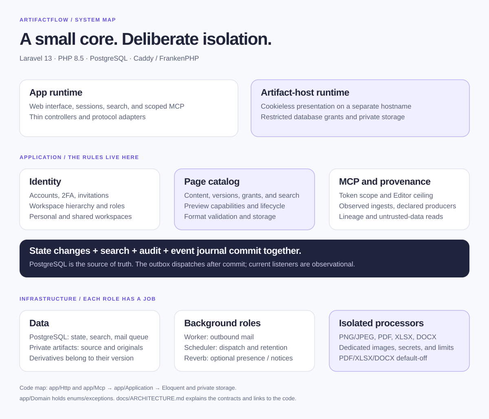
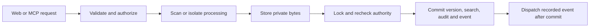

# Architecture

ArtifactFlow is a self-hosted workspace for AI-generated artifacts. Its storage
model is a versioned artifact vault: stable pages, immutable retained content,
searchable text, permissions, provenance, and audit history.

The application is a Laravel modular monolith. PostgreSQL holds current state,
full-text search, queues, and the event journal. Private storage holds artifact
bytes. There is no event sourcing or separate search service.

## Runtime boundaries

| Runtime | Responsibility |
| --- | --- |
| App | Login, sessions, CSRF, web workflows, search, MCP, preview authorization |
| Artifact host | Cookieless delivery of authorized saved versions and content-bound unsaved HTML previews |
| Image parser | Isolated PNG/JPEG decoding and normalization |
| PDF processor | Isolated validation and bounded native-text extraction |
| XLSX processor | Isolated package validation and typed visible-cell projection |
| DOCX processor | Isolated package validation and LibreOffice conversion; PDFBox independently validates the output |
| Worker | Database-backed outbound mail queue |
| Scheduler | Event dispatch each minute and nightly retention jobs |
| Reverb | Optional presence and version notices, disabled by default |

App, artifact-host, worker, and scheduler share one image. Non-HTTP roles also
need their worker/scheduler start command; setting `APP_RUNTIME_ROLE` alone
does not start those processes. Native processors use separate images.

The two HTTP origins use different hostnames. Untrusted HTML never enters the
authenticated app DOM. The artifact host has restricted database credentials,
private storage, and no processor secrets. Deployment instructions live in
[production operations](operations/production.md).

## A write, from request to retained version

Command handlers coordinate use cases. Controllers and MCP adapters validate
their boundary and delegate; views render prepared data. Application services
own business rules, authorization, concurrency, and transactions. `app/Domain`
contains mostly enums and exceptions. Eloquent supplies persistence.

Important state changes, search projections, audit entries, and durable events
commit together. Events form a transactional outbox, but today's listener is
observational. Outbound invitation state and its encrypted mail job also commit
together. The design is deliberately synchronous where atomicity matters.

Files cannot join a PostgreSQL transaction. Writes promote bytes before the
version row commits, preserve them when commit acknowledgement is uncertain,
and leave unreferenced old files to the age-gated orphan reaper. Backup must
capture the database and private files together.

## Data model

Business identifiers are ULIDs exposed as `uid` and `*_uid`.

| Records | Meaning |
| --- | --- |
| Users, workspaces, memberships, invitations | Identity and collaboration boundaries |
| Pages | Stable identity, current-version pointer, owner, status, placement, metadata revision |
| Page versions and derivatives | Immutable authoritative payloads plus hash-bound XLSX manifests or DOCX PDFs |
| Ingest records and producer assertions | Observed submission facts, optional self-reported producers, restore lineage |
| Grants, categories, tags | Page access and catalog vocabulary |
| MCP tokens and client sessions | Hashed credentials and bounded unverified client metadata |
| Audit entries and domain events | User-facing history and transactional event journal |

Content appends and restores create versions. Metadata has its own concurrency
revision. Retention prunes old content; provenance survives content pruning.
Hard page deletion removes the whole graph. See the
[artifact lifecycle](ARTIFACT-LIFECYCLE.md).

## Authorization and discovery

`PageAccess` and the identity handlers enforce access on the server. Reader,
Editor, and Admin are workspace/content roles. System Admin manages the
installation and accounts; it is not a content superuser.

Shared workspaces support three levels. Membership may flow downward through
enabled inheritance boundaries. Personal workspaces remain standalone. Page
trees, categories, storage accounting, selected Libraries, and selected MCP
workspace scopes stay exact-workspace concerns. See
[nested workspaces](architecture/nested-workspaces.md).

Registered human names, emails, and UIDs are intentionally discoverable within
the installation. They confer no authority. Reader/Editor page grants may
target registered humans; page Admin grants require workspace membership.
Private page titles, hierarchy, and taxonomy require live visibility checks.

Search uses PostgreSQL `simple` full-text matching plus exact authorization
post-filtering. The application maintains `pages.search_vector`, including
related labels. Every new rename or mutation path must refresh affected vectors.
Structured provenance filters cover all retained ingests; full-text provider
labels are capped at 256 deduplicated pairs. External provenance references
never enter search or telemetry.

## Rendering and AI access

| Format | Presentation |
| --- | --- |
| Markdown + Mermaid | Sanitized Markdown and strict Mermaid in the app |
| HTML | Separate origin, opaque scripts-only sandbox, restrictive header CSP |
| PNG/JPEG | Normalized raster in a scriptless artifact-origin frame |
| XLSX | Fixed artifact-origin grid consuming only the validated manifest |
| PDF / DOCX | Native PDF viewing on the artifact origin; DOCX uses only its independently validated derivative |

PDF viewing is download-equivalent and has the documented PDF-only sandbox
exception. PDF, XLSX, and DOCX remain default-off. The
[threat model](../THREAT-MODEL.md) and [format decisions](architecture/README.md)
define these boundaries and their residual risks.

`POST /mcp` exists only on the app. Tokens intersect operation scope, exact
workspace scope, and live user authority, with Admin capped at Editor.
Content is returned as untrusted data. It never grants permission for a later
write. See [MCP setup and scopes](operations/mcp.md).

## Concurrency, readiness, and production

- Content writes require the expected current version. Metadata writes require
  the expected metadata revision. Description writes bind both observations.
- Hierarchy mutations serialize under a PostgreSQL advisory lock, recheck
  authority, and invalidate affected descendant preview access.
- Realtime presence is advisory. Version notices never automatically reload the
  app or discard unsaved work. Revoked existing sockets may retain bounded
  presence metadata until they close.
- Missing migrations fail closed before browser sessions or MCP token lookup.
  `/up` stays session-free; the artifact host reveals no installation status.
- The production boot gate validates origins, secrets, TLS, private storage,
  sessions, mail, processor configuration, and proxy/cache isolation.
- Ordinary caching supports shared-capable drivers; production rate limiting currently supports only the dedicated database limiter stores.

For checks and recovery, use [operations](OPERATIONS.md). For engineering and
required gates, use [AGENTS.md](../AGENTS.md). Future product work belongs in
the [roadmap](../ROADMAP.md).
