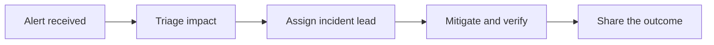

# Incident response guide

Keep the response calm, coordinated, and visible. This is the shared playbook for the fictional Northstar Labs team.

> **First five minutes:** acknowledge the alert, choose an incident lead, and open a shared incident note.

## Response flow

## Who does what

| Role           | Responsibility                      | Example owner |
| -------------- | ----------------------------------- | ------------- |
| Incident lead  | Coordinate decisions and next steps | Alex Morgan   |
| Technical lead | Investigate, mitigate, and verify   | Jamie Chen    |
| Communications | Keep the team informed              | Sam Rivera    |

## Working checklist

- [x] Confirm the affected service and customer impact.
- [x] Assign one person to coordinate the response.
- [ ] Apply the smallest reversible mitigation.
- [ ] Verify recovery with a second engineer.
- [ ] Record the timeline and follow-up actions.

## After recovery

Keep the original incident note, record the decisions that helped, and add a new version of this guide when the process changes. Link follow-up work to the relevant release checklist.
